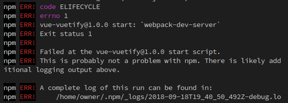
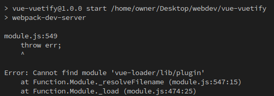

# Vuejs + Vuetify

***For a more detailed explanation about this boilerplate, see the from scratch instructions below**

## Setup

- clone this repo, and open it in VsCode

- You'll want to install the `Vueter` extension in VsCode
  - syntax highlighting, snippets

- run `npm install` to install dependencies

## Running the app

- run `npm start` to start the development server

:+1:

---

## Add some stuff

- Go to https://vuetifyjs.com/en/ and browse the components

- We'll pick a couple


<details>
  <summary>From scratch instructions</summary>


---
Initialize a git repo (version contorl is good)
```sh
git init
```
---

Initialize a npm project

```sh
npm init -y # accept all the defaults
```

---

install `webpack`

```sh
npm install --save-dev webpack webpack-cli webpack-dev-server
```

- webpack is in charge of compiling your application
- magic

---

you don't want `node_modules` in your `git` history

We'll create a `.gitignore` file with this line:

```js
// .gitignore
node_modules
```


---

add `webpack.config.js`
- when webpack runs, it will use this config

```js
const path = require('path')
const webpack = require('webpack')
const VueLoaderPlugin = require('vue-loader/lib/plugin')
const HtmlWebpackPlugin = require('html-webpack-plugin')


module.exports = {
	entry: './src/main.js',
  output: {
    path: path.resolve(__dirname, './dist'),
    filename: 'build.js',
  },
  resolve: {
    modules: ['src', 'node_modules'],
  },
  module: {
    rules: [
      {
        test: /\.vue$/,
        loader: 'vue-loader',
      },
      {
        test: /\.js$/,
        loader: 'babel-loader',
        exclude: /node_modules/,
      },
      {
        test: /\.(png|jpg|gif|svg|json)$/,
        loader: 'file-loader',
        query: {
          name: '[name].[ext]?[hash]',
        },
      },
      {
        test: /\.html$/,
        loader: 'raw-loader',
      },
      {
        test: /\.css$/,
        loader: ['style-loader', 'css-loader'],
      }
    ],
  },
  devServer: {
    historyApiFallback: true,
    noInfo: false,
    open: true,
  },
  devtool: '#eval-source-map',

  plugins: [
    new VueLoaderPlugin(),
    new HtmlWebpackPlugin({
      template: './src/index.html',
    }),
  ],

  mode: process.env.NODE_ENV,
}

if (process.env.NODE_ENV === 'production') {
  module.exports.devtool = '#source-map'
  // http://vue-loader.vuejs.org/en/workflow/production.html
  module.exports.plugins = (module.exports.plugins || []).concat([
    new webpack.DefinePlugin({
      'process.env': {
        NODE_ENV: '"production"',
      },
    }),
    new webpack.optimize.UglifyJsPlugin({
      compress: {
        warnings: false
      }
    })
  ])
}
```

---

we'll also add the bare-bones of our app: `src/main.js` and `src/index.html`

add some scripts to your `package.json`, which allow you to run webpack
- for development: 
  ```sh
	npm start`
	```
- for production build:
  ```sh
	npm run build`
	```

---

run your development script: `npm start` and...errors:



:+1:

scroll up to see the real error:




---

bring in the `webpack loaders` 
- these are in charge of interpreting the different types of files you're compiling (ex. `.vue .js .html`)

- we'll be installing the followling loaders:
  - `vue-loader` : .vue files
	- `babel-loader` : js files
	- `style-loader css-loader` : .css files
	- `file-loader` : any file as a filepath
	- `raw-loader` : any file as a raw string

```sh
npm install --save-dev vue-loader babel-loader style-loader css-loader file-loader raw-loader
```

---

We also need `webpack plugins`
- these do other things to your files (ex. copying files, minification)

- we'll be using the following `webpack plugins`:
  - `html-webpack-plugin` : automatically creates a `index.html` entry file for you

```sh
npm i -D html-webpack-plugin
```
---

But wait, `babel-loader` needs some more stuff

`babel` requires a whole host of dependencies in itself

```
npm i -D @babel/core @babel/preset-env
```


Now run `npm start` again:

</details>